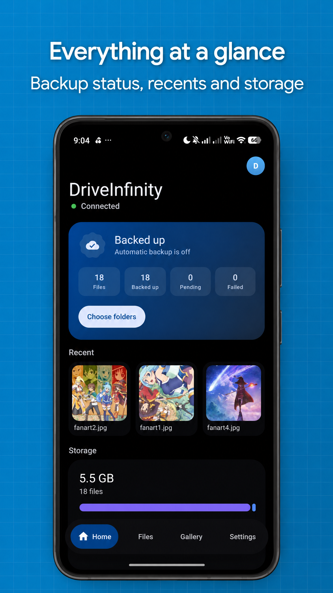
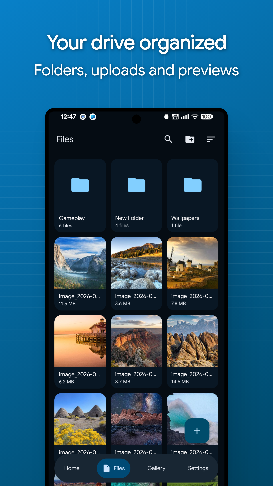
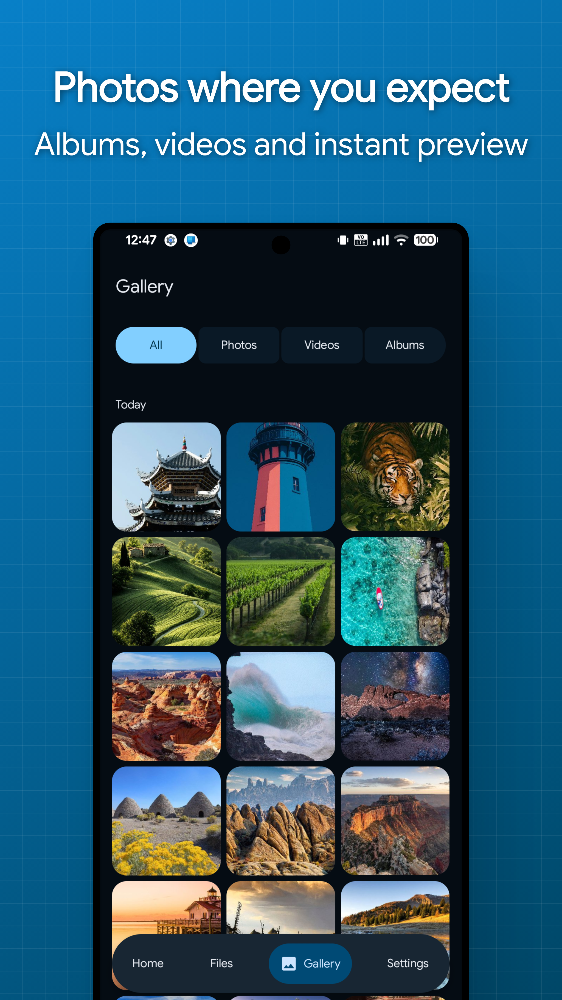
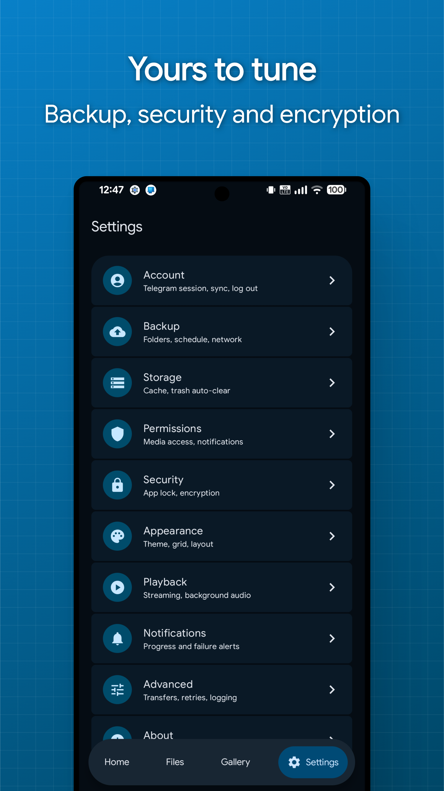

<div align="center">


# Drive∞

Back up and browse your files using a private Telegram channel as storage.

[](#requirements)
[](https://kotlinlang.org)
[](https://www.jetbrains.com/compose-multiplatform/)
[](https://github.com/ZHINFINITY/DriveInfinity/releases/latest)
[](https://github.com/ZHINFINITY/DriveInfinity/releases)
[](LICENSE)
<br><br>
</div>

---

## About

DriveInfinity stores your files in a private Telegram channel on your own account.
There is no DriveInfinity server and no account to create with us. The app keeps a
local index so browsing and search stay fast and work offline.

One Compose Multiplatform codebase ships the Android app and the Windows
desktop app. They share the storage engine, encryption, transfers and the
entire UI layer, and both browse the same drive.

## Features

- **Automatic backup**: photos and chosen folders upload on their own on Android, with schedules, Wi-Fi and charging rules, and exclusion patterns
- **No file size limit**: a 20 GB video is one file in the app, whatever Telegram caps a message at
- **Encryption**: optional AES-256-GCM for file bodies, names, captions and the folder tree
- **File management**: folders, favorites, hidden and archived items, trash and bulk actions
- **Streaming**: video and audio play straight from Telegram with seeking, encrypted files included
- **Previews**: images, PDFs, text and ZIP contents open inline
- **Multiple drives**: separate channels for personal, work or photos on one account
- **Sharing**: files arrive from the Android share sheet, and identical bytes are never uploaded twice
- **Transfers**: parallel queue with pause and resume that survives reboots
- **Recovery**: reinstall, sign in, enter your passphrase, and the whole drive is back
- **Device security**: biometric app lock, screenshot blocking and an encrypted local cache

## Screenshots

<div align="center">
   
</div>

## Install

### Windows

Download `DriveInfinity-<version>.msi` from the [releases page](../../releases) and
run it. It installs per user with no admin prompt, adds Start menu and desktop
shortcuts, and uninstalls from Windows Settings. Your session and settings live
in `%APPDATA%\DriveInfinity` and survive reinstalls.

### Android

Grab an APK from the [ARM64 GitHub Actions workflow](../../actions/workflows/drive-infinity-arm64.yml) or [releases page](../../releases). Builds are split per CPU
architecture, so pick the one that matches your device:

| APK | Use it when |
| --- | --- |
| `DriveInfinity-<version>-arm64-v8a-release.apk` | Almost every phone from the last several years |
| `DriveInfinity-<version>-armeabi-v7a-release.apk` | Older 32-bit devices |
| `DriveInfinity-<version>-x86_64-release.apk` | 64-bit emulators and x86 Chromebooks |
| `DriveInfinity-<version>-x86-release.apk` | 32-bit x86, rare outside older emulators |
| `DriveInfinity-<version>-universal-release.apk` | You are unsure, or sideloading somewhere unusual |

The universal one carries every architecture at once, so prefer a specific build
unless you need the fallback. Most of that size is TDLib, the official Telegram
library the app is built on.

## Requirements

- Android 8.0 (API 26) or newer, or 64-bit Windows 10+
- A Telegram account
- Your own Telegram API credentials, free from
  [my.telegram.org](https://my.telegram.org) under *API development tools*

To get credentials: sign in at [my.telegram.org](https://my.telegram.org), open
*API development tools*, and fill in an app name and short name. Anything
sensible works, and the platform and description do not matter. The page then
shows an **api_id** and an **api_hash**, which is what DriveInfinity asks for on
first launch.

You enter the API ID and hash at runtime and they are stored encrypted on
device. They are never bundled into the app, written to logs, or sent anywhere
except Telegram. Because they are yours rather than shared, your usage is never
pooled with anyone else's, and a rate limit on someone else cannot affect you.

## Getting started

```bash
git clone https://github.com/ZHINFINITY/DriveInfinity.git
cd DriveInfinity
./gradlew :android:installDebug  # Android
./gradlew :desktop:run           # Windows desktop
```

Then in the app:

1. Enter your API ID and hash.
2. Sign in, either by phone number and login code, or by choosing **Sign in by
   QR code**. If Telegram is installed on the same device, the QR step offers a
   **Confirm in Telegram** button instead, so nothing needs scanning.
3. Choose the folders to back up.
4. Optionally enable **Encrypt uploads** and set a recovery passphrase.

TDLib native libraries come prebuilt on both platforms: the
[`tdlibx/td`](https://github.com/tdlibx/td) AAR via JitPack on Android and
[tdlight](https://github.com/tdlight-team/tdlight-java) on desktop, so no
native toolchain is needed.

### Packaging the desktop app

jpackage does the packaging, and the Android Studio runtime does not ship it.
Point the build at a full JDK with a `desktopJavaHome` property in your global
`~/.gradle/gradle.properties`, then:

```bash
./gradlew :desktop:packageMsi           # installer
./gradlew :desktop:createDistributable  # portable folder with DriveInfinity.exe
```

## Bringing existing files in

Already have files sitting in a channel, a group, or Saved Messages? Forward
them into the drive DriveInfinity created and they appear in the app after the next
sync. Forwarding happens on Telegram's servers, so nothing is downloaded or
uploaded again, and files of any size come across in seconds.

Select the messages in the Telegram app, forward them to your DriveInfinity
channel, then pull to refresh in DriveInfinity.

What to expect for forwarded files:

- Only messages sent **as documents** are picked up. A photo or video sent the
  normal way was compressed by Telegram into a media message, and those are
  skipped. Forward the original file version instead.
- **Captions are replaced.** DriveInfinity stores each file's name, folder and
  flags in the caption, so the first rename, move or trash overwrites whatever
  text the message carried.
- **No checksum is recorded**, since the file is never read locally. Duplicate
  detection cannot match forwarded files, so uploading the same file later
  creates a second copy.
- Files land at the drive root and stay unencrypted, because they were already
  stored that way. Move them into folders in the app afterwards.

## Architecture

Kotlin Multiplatform with Clean Architecture and MVVM. The dependency rule is
`presentation -> domain <- data`, with `core` shared by both sides. No TDLib
type leaves `core/telegram`. Almost everything lives in common code; each
platform contributes only what the other cannot share, like workers, the
Keystore, DPAPI and the app shells.

```text
shared/               # KMP: storage engine, crypto, sync, transfers
├── commonMain/           # core, data, domain
├── jvmCommonMain/        # JVM pieces both apps use
├── androidMain/          # Keystore, MediaStore, WorkManager glue
└── desktopMain/          # tdlight client, DPAPI, desktop schedulers
ui/                   # KMP: every screen, theme and string resource
├── commonMain/           # compose resources
└── jvmCommonMain/        # the entire presentation layer
android/              # Android shell: workers, notifications, media3 player
desktop/              # Windows shell: window, packaging, streaming bridge
```

Stack: Kotlin Multiplatform, Coroutines, Compose Multiplatform, Material 3
Expressive, Koin, Room KMP, DataStore, WorkManager, Paging 3, Media3, Coil,
TDLib and tdlight.

## Security model

| Layer | What is protected |
| --- | --- |
| On device | Room and TDLib databases sealed with a random, platform-wrapped key (Android Keystore, Windows DPAPI). Thumbnails and caches AES-GCM encrypted by default. |
| In Telegram | With encryption on, the channel holds only sealed bytes, random file names, encrypted captions and an encrypted folder tree. |
| Key custody | Content keys are random, wrapped by the platform master key, and never leave the device unwrapped. |
| Recovery | The content key is backed up to your channel, sealed with your passphrase (PBKDF2, 310k iterations). Restoring it on a new device unlocks everything. |

Someone who reads the channel without your key learns only the file count,
sizes and timestamps. The passphrase has no reset path, which is the point, so
set a hint when you create it and keep the passphrase out of the hint.

## Good to know

- A file past Telegram's per-file cap is stored as several messages, so opening
  it in the Telegram app shows the parts rather than the whole file. Only
  DriveInfinity puts it back together.
- Streaming authenticates the frames it plays, not the whole file. Downloading
  verifies everything, so use it when integrity matters more than starting fast.
- Telegram cannot rename a document inside a sent message, so a rename updates
  the caption manifest, which is what a rebuild reads.
- TDLib cannot resume a single upload, so pausing one that fits in one message
  restarts it. A split upload resumes at the last completed part, and downloads
  always resume.

## Testing

```bash
./gradlew testDebugUnitTest          # Unit tests covering crypto, key backup,
                                     # query building, backup decisions, naming
./gradlew connectedDebugAndroidTest  # Room DAO behaviour on a device
./gradlew :desktop:test              # Desktop DI graph and platform seams
```

## Contributing

Issues and pull requests are welcome. Keep the dependency rule intact, match the
surrounding code style, and add tests for changes in the domain or crypto
packages of `shared/`.

## License

[Apache License 2.0](LICENSE).

TDLib is BSL-1.0. The prebuilt Android wrapper (`tdlibx/td`) is Apache-2.0.

---

<div align="center">
<sub>DriveInfinity is an independent project, not affiliated with or endorsed by Telegram.</sub>
</div>
